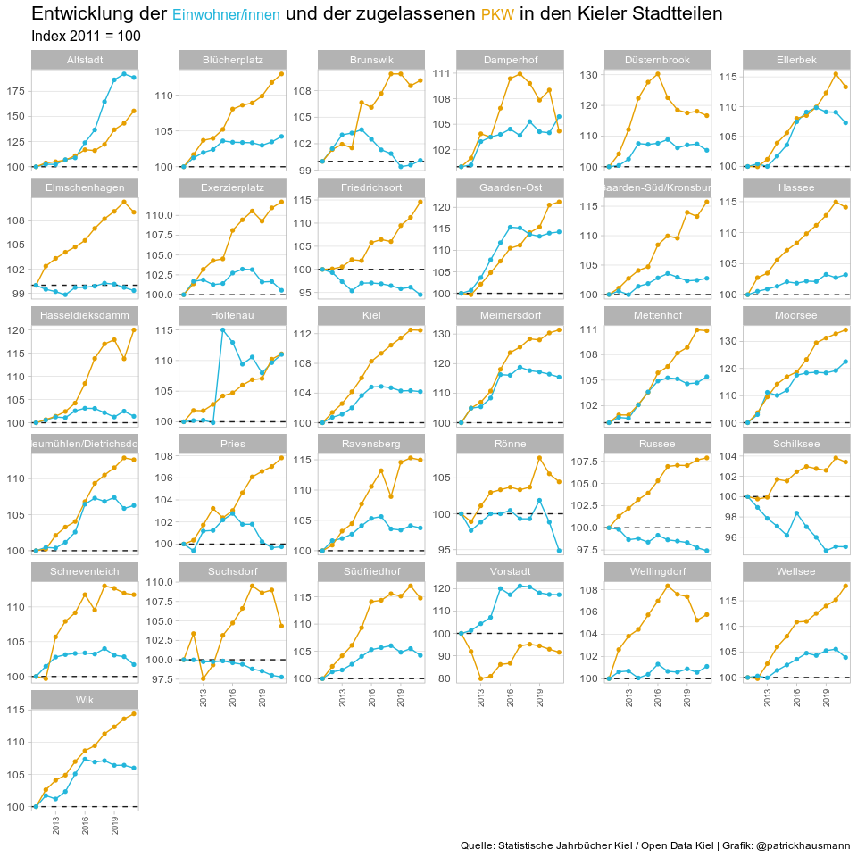

KFZ Bestand in Kiel
================

``` r
library(pdftools)
```

    ## Using poppler version 0.74.0

``` r
library(rvest)
library(tidyverse)
```

    ## ── Attaching packages
    ## ───────────────────────────────────────
    ## tidyverse 1.3.2 ──

    ## ✔ ggplot2 3.4.0      ✔ purrr   0.3.5 
    ## ✔ tibble  3.1.8      ✔ dplyr   1.0.10
    ## ✔ tidyr   1.2.1      ✔ stringr 1.4.1 
    ## ✔ readr   2.1.3      ✔ forcats 0.5.2 
    ## ── Conflicts ────────────────────────────────────────── tidyverse_conflicts() ──
    ## ✖ dplyr::filter()         masks stats::filter()
    ## ✖ readr::guess_encoding() masks rvest::guess_encoding()
    ## ✖ dplyr::lag()            masks stats::lag()

``` r
library(readr)
library(robotstxt)
library(httr)
library(scales)
```

    ## 
    ## Attache Paket: 'scales'
    ## 
    ## Das folgende Objekt ist maskiert 'package:purrr':
    ## 
    ##     discard
    ## 
    ## Das folgende Objekt ist maskiert 'package:readr':
    ## 
    ##     col_factor

``` r
library(lubridate)
```

    ## Lade nötiges Paket: timechange
    ## 
    ## Attache Paket: 'lubridate'
    ## 
    ## Die folgenden Objekte sind maskiert von 'package:base':
    ## 
    ##     date, intersect, setdiff, union

``` r
library(ggtext)
library(qpdf)
library(here)
```

    ## here() starts at /home/patrick/Dokumente/02_code/kfzkiel

``` r
source(here::here("R", "utils.R"))
```

## Collect KFZ-Daten

``` r
robotstxt::paths_allowed("https://www.kiel.de/de/kiel_zukunft/statistik_kieler_zahlen/statistische_jahrbuecher.php")

urls <- url_stat_jahrbuecher(year = 2011:2021)

kfz <- purrr::map2_df(.x = urls$url, .y = urls$jahr, .f = extract_kfz_page)

write_csv(kfz, here::here("data", "kfz_kiel_2011_2021.csv"))
```

## Collect EinwohnerInnen-Daten

``` r
ew <- readr::read_csv2("https://www.kiel.de/opendata/kiel_bevoelkerung_stadtteile.csv") |>  
  pivot_longer(cols=`1988`:`2021`, names_to = "jahr", values_to = "ew_ins") |> 
  mutate(jahr = as.integer(jahr)) |> 
  select(stadtteil = Stadtteil, jahr, ew_ins)

ew_kiel <- ew |>
  group_by(jahr) |> 
  summarise(ew_ins = sum(ew_ins)) |> 
  mutate(stadtteil = "Kiel_insgesamt", .before = 1)

ew <- bind_rows(ew, ew_kiel)

ew <- ew %>% 
  mutate(stadtteil = str_replace(stadtteil, "Duesternbrook", "Düsternbrook")) %>% 
  mutate(stadtteil = str_replace(stadtteil, "Bluecherpatz", "Blücherplatz")) %>% 
  mutate(stadtteil = str_replace(stadtteil, "Suedfriedhof", "Südfriedhof")) %>% 
  mutate(stadtteil = str_replace(stadtteil, "Gaarden-Sued/Kronsburg", "Gaarden-Süd/Kronsburg")) %>% 
  mutate(stadtteil = str_replace(stadtteil, "Neumuehlen/Dietrichsdorf", "Neumühlen/Dietrichsdorf")) %>% 
  mutate(stadtteil = str_replace(stadtteil, "Roenne", "Rönne"))

write_csv(ew, here::here("data", "einwohner_1988_2021.csv"))
```

## Join Bestand mit Einwohnern

``` r
kfz_ew <- inner_join(kfz, ew, by = c("jahr", "stadtteil")) |> 
  mutate(stadtteil = str_replace_all(stadtteil, "Kiel_insgesamt", "Kiel"))

saveRDS(kfz_ew, here::here("data", "kfz_ew_2011_2021.RDS"))
write_csv(kfz_ew, here::here("data", "kfz_ew_2011_2021.csv"))
```

## PKW Index 2011 = 100

``` r
kfz_ew |> 
  pivot_longer(cols = kfz_ins:ew_ins, names_to = "kategorie") |> 
  arrange(stadtteil, jahr) |> 
  group_by(stadtteil, kategorie) |> 
  mutate(idx100 = value / first(value) * 100) %>% 
  ungroup() |> 
  dplyr::filter(kategorie %in% c("pkw_ins", "ew_ins")) |> 
  ggplot(aes(x = jahr, y = idx100, group = kategorie, color = kategorie)) + 
  geom_line() + 
  geom_hline(yintercept = 100, linetype = "dashed", color = "grey10") + 
  scale_color_manual(values=c('#23B6DB','#E69F00')) +  
  facet_wrap(vars(stadtteil), 
             labeller = labeller(facet_category = label_wrap_gen(width = 46)), 
             scales = "free_y"
             ) + 
  geom_point(size = 1.2) +
  labs(x = NULL,
       y = NULL,
       title = "Entwicklung der <span style='color:#23B6DB;font-size:12pt;'>Einwohner/innen</span> und der zugelassenen <span style='color:#E69F00;font-size:12pt'>PKW</span> in den Kieler Stadtteilen",
       subtitle = "Index 2011 = 100", 
       caption = "Quelle: Statistische Jahrbücher Kiel / Open Data Kiel | Grafik: @patrickhausmann"
  ) +
  theme_light() +
  theme(
    legend.position = "none",
    axis.text.x = element_text(angle = 90, hjust = 1, vjust = 0.5, size = 7),
    axis.text.y = element_text(size = 9),
    panel.grid.major.x = element_blank(),
    panel.grid.minor.x = element_blank(),
    panel.grid.minor.y = element_blank(),
    plot.title = element_markdown(size = 16),
    plot.subtitle = element_markdown(size = 12))
```

<!-- -->
